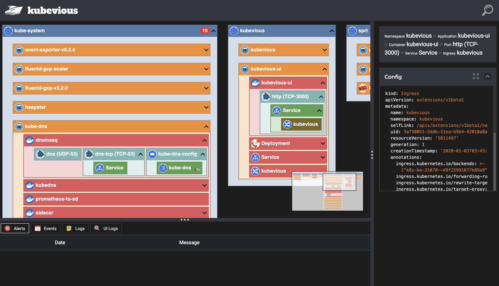

# Kubevious

[](https://g.codefresh.io/public/accounts/kubevious/pipelines/5dfac9226e1ebecb0fd3775d)
[](https://opensource.org/licenses/Apache-2.0)

Modern application deployments are very complex. It is hard to make sense
of existing deployments. **Kubevious** is made to help operators to navigate  infrastructure and deployment configurations.



## Running Kubevious
Deploy using Helm:

```sh
kubectl create namespace kubevious

git clone https://github.com/kubevious/deploy.git kubevious-deploy.git
cd kubevious-deploy.git/kubernetes

helm template kubevious \
    --namespace kubevious \
    > kubevious.yaml

kubectl apply -f kubevious.yaml
```

Setup port forwarding:

```sh
kubectl port-forward $(kubectl get pod -l k8s-app=kubevious-ui -n kubevious -o jsonpath="{.items[0].metadata.name}") 3000:3000 -n kubevious
```

Access from browser: http://localhost:3000

For more details on installation options visit [Deployment Repository].

# Authors
Everyone is welcome to contribute. See [CONTRIBUTING] for instructions on how to contribute.

# License
Kubevious is an open source project licensed under the [Apache License]. 

[Deployment Repository]: https://github.com/kubevious/deploy
[Apache License]: https://www.apache.org/licenses/LICENSE-2.0
[CONTRIBUTING]: CONTRIBUTING.md
